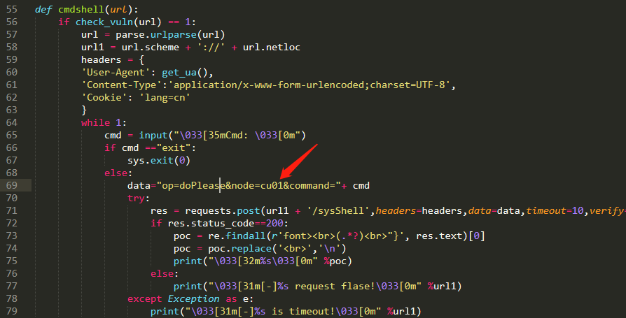
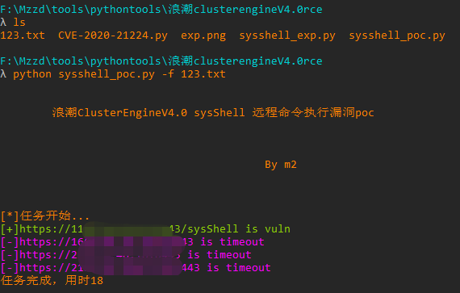
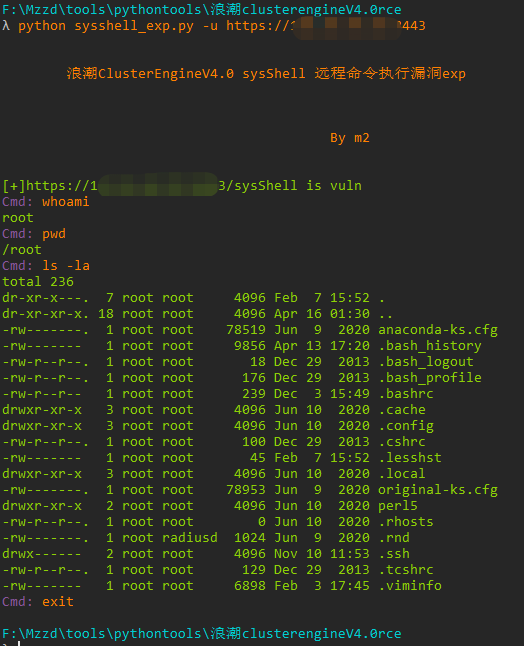

# ClusterEngineV4.0sysShell_RCE

浪潮ClusterEngineV4.0 sysShell文件存在远程命令执行漏洞。

## Fofa指纹

title="TSCEV4.0"

## 工具利用

注意脚本data中的node参数需要为集群中实际存在的主机，根据实际情况进行修改，这里使用默认的cu01。

poc：

python3 sysshell_poc.py -u http://127.0.0.1:1111 单个url测试

python3 sysshell_poc.py -f url.txt 批量检测

exp：

python3 sysshell_exp.py -u http://127.0.0.1:1111

## 免责声明

由于传播、利用此文所提供的信息而造成的任何直接或者间接的后果及损失，均由使用者本人负责，作者不为此承担任何责任。
